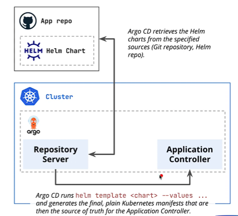

# Working with Helm charts



Argo CD uses Helm primarily to render templates. It effectively runs `helm template`, then Argo CD applies and tracks the resulting Kubernetes resources.

Consequences:

- Argo CD does not run `helm install`, `helm upgrade`, or `helm uninstall` for an Application.
- The release does not have Helm release history or a Helm release Secret.
- Rollback normally means reverting or selecting an earlier Git revision/chart version and syncing it.
- Argo CD, rather than Helm, owns reconciliation, pruning, health, and resource tracking.

An Application can use a chart from a Helm repository/OCI registry or a chart stored in Git:

```yaml
spec:
  source:
    repoURL: https://prometheus-community.github.io/helm-charts
    chart: prometheus
    targetRevision: 27.49.0
    helm:
      valueFiles:
        - values-prod.yaml
```

For a Helm repository, `targetRevision` is a chart version. For a Git-hosted chart, use `path` instead of `chart`, and `targetRevision` identifies a Git branch, tag, or commit.

Pin chart versions in production. If value files live in another repository, use Argo CD multiple sources and a source `ref`; ordinary `valueFiles` paths are otherwise resolved from the chart source.
