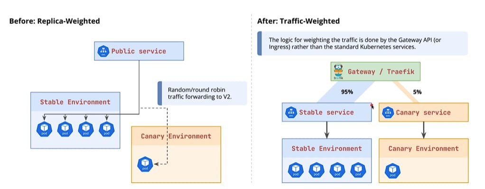
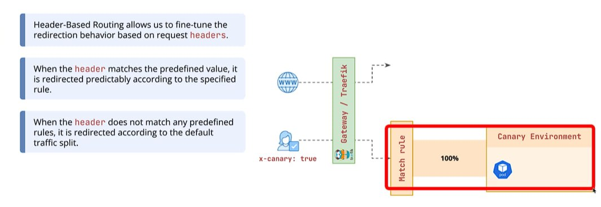
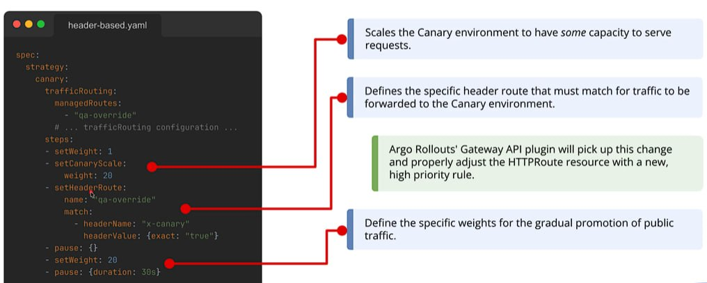

## Limitations of Replica-Weighted Strategies

1. Understanding the challenges of precise traffic splitting based solely on pod counts.

- Limitation 1: The Precision Problem
  - How do we achieve a 10% traffic split if our ReplicaSet has only two Pods?

- Limitation 2: Resource Waste
  - To achieve fine-grained steps (1%, 2%, 5%), you are forced to over-provision your infrastructure.

- Limitation 3: No Header-Based Routing
  - It's not possible to redirect traffic predictably with the use of custom headers.

2. The need for more advanced traffic controls beyond standard Kubernetes services.

## Gateway API & Environment Setup

1. Installing the Kubernetes Gateway API CRDs and deploying Traefik as the Gateway Controller.
2. Configuring the Argo Rollouts Gateway API Plugin to enable advanced traffic management.

## Traffic-Weighted Canary Deployments

1. Decoupling traffic distribution from replica counts for granular control.
2. Exploring how Argo Rollouts dynamically manages HTTPRoute resources.


## Header-based Routing

1. Implementing deterministic routing for QA and testing purposes.
2. Combining traffic weights with specific route matching rules.



### Canary traffic vs canary scale

Traffic weight and pod count can be controlled separately:

```yaml
- setWeight: 1
- setCanaryScale:
    weight: 40
- setHeaderRoute:
    name: qa-override
    match:
      - headerName: x-canary
        headerValue:
          exact: "true"
```

With five desired replicas, this creates two canary pods (`40% of 5`) while sending only 1% of normal traffic to them. Requests containing `x-canary: true` are sent directly to the canary, giving QA a predictable way to test it.

```text
Normal traffic: 99% stable, 1% canary
QA header:      100% canary
Pod capacity:   5 stable + 2 canary
```

The extra canary pods are intentional testing capacity. On abort they scale down; after a successful rollout the canary becomes stable and the old stable ReplicaSet scales down.

The canary can still receive requests in two ways:

- A normal request has approximately a 1% chance of reaching it because of `setWeight: 1`.
- A request with `x-canary: true` is always sent to it by the header route.

`setCanaryScale: 40` does not send 40% of traffic to the canary. It only creates two canary pods to provide enough capacity for testing.

## AnalysisTemplate

An Argo Rollouts `AnalysisTemplate` defines automated checks for a rollout. For example, it can query Prometheus to confirm that the canary's success rate is acceptable before continuing.

```text
Canary receives traffic -> AnalysisTemplate checks Prometheus
-> pass: rollout continues
-> fail: rollout fails or aborts
```

The Rollout refers to the template by name:

```yaml
- analysis:
    templates:
      - templateName: success-rate
```

An `AnalysisTemplate` named `success-rate` must already exist in the same namespace. Otherwise, the Rollout has an `InvalidSpec` error and does not create pods. A `ClusterAnalysisTemplate` can be used instead when the template should be available cluster-wide.

### Inline vs background analysis

An inline analysis is listed inside `steps`. It blocks the rollout and runs once when that step is reached.

A background analysis is configured directly under `strategy.canary.analysis`. It checks Prometheus while the canary progresses through its weights and pauses:

```yaml
strategy:
  canary:
    analysis:
      templates:
        - templateName: success-rate
      args:
        - name: service-name
          value: analysis-canary-canary
    steps:
      - setWeight: 20
      - pause:
          duration: 3m
      - setWeight: 40
```

In the `AnalysisTemplate`, an interval without a count keeps measuring until the rollout completes or fails:

```yaml
interval: 5s
successCondition: result[0] >= 0.95
failureLimit: 3
```

```text
Canary update starts -> background checks begin -> rollout steps continue
3 failed checks -> rollout aborts
Rollout completes -> background AnalysisRun stops
```

Background analysis is skipped on the first deployment because there is no old and new version to compare. After deployment, normal Prometheus alerts should provide permanent production monitoring.
