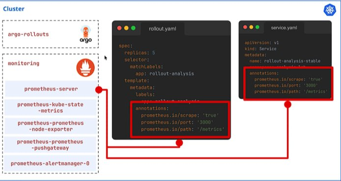
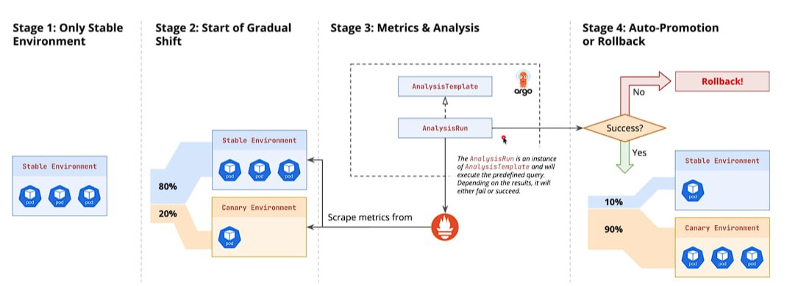

## 1. Prometheus & Metrics Architecture

- Overview of the monitoring stack and service discovery.
- Installing Prometheus via the community Helm chart in the `monitoring` namespace.

This diagram shows how Prometheus service discovery automatically targets your application to collect metrics during deployment.

### Key Components

**Prometheus annotations** (red highlight boxes) are added to both `rollout.yaml` (Pod template) and `service.yaml`:

- `prometheus.io/scrape: 'true'` → Tells Prometheus to scrape metrics from this resource.

- `prometheus.io/port: '3000'` → Defines the port exposing the metrics.

- `prometheus.io/path: '/metrics'` → Defines the endpoint path where metrics are published.

**`prometheus-server`** (in the `monitoring` namespace): Reads these annotations in the Kubernetes cluster automatically to continuously collect performance and health data.

**`argo-rollouts`**: Uses collected Prometheus metrics to analyze deployments automatically (for example, deciding whether to promote or roll back a release based on health metrics).

---

## 2. Automated Analysis & Promotion

- Integrating metrics into the rollout process to enable automated decision-making.
- Defining AnalysisTemplates and implementing self-healing.

---

## 3. Analysis in Canary and Blue-Green Strategies

- **Canary analysis**: Run analysis as a step or continuously in the background.
- **Blue-Green analysis**: Validate preview environments before switching traffic.
- **Handling arguments**: Parameterize queries and thresholds for reusability.