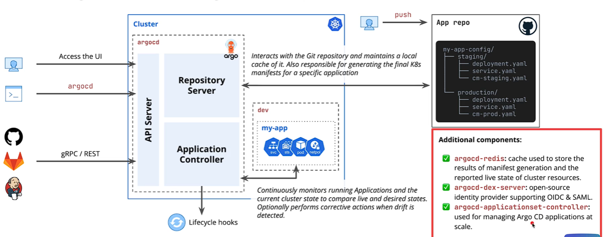
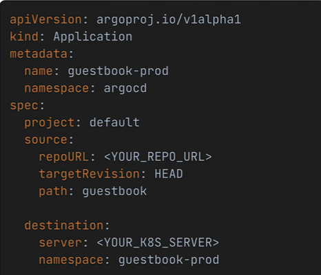

## The argocd Components 

- on the ui when you make requests it hits the api server, the server is responsible with communicating the internal components and retunring the correct response - can be interacted with grpc/rest
- how does argocd interact with git repo? - the repository server will interact with a local cache of it, it is also responsible for generating the final k8s manifests for a specific application 
- application controller continously monitor the cluster and applications (custom resource )

## The application crd

- It defines a declarative GitOps link connecting a Git repository (the desired state) to a Kubernetes cluster (the live target environment).
- The purpose of application crd is to be declarative contract that describes several important for argo CD to do its job
1. **Project:** Under which Argo CD project should the application be managed?
2. **Source (`spec.source`):** *WHERE is the desired state defined?* This normally includes a Git repository URL, a branch, and a path or Helm chart).
3. **Destination (`spec.destination`):** *WHERE should the manifests from that source be deployed?* More specifically, which cluster and namespace?
4. **[Optional] Sync Policy (`spec.syncPolicy`):** *HOW should the deployment be managed?* Should it be automated, prune resources, self-heal, etc.?

## Argo CD Applications vs. Kubernetes Manifests

| Argo CD Applications vs. Kubernetes Manifests |  |  |
| --- | --- | --- |
| **Concept** | **Application CRD** | **Kubernetes Manifests** |
| `kind:` | `Application` | `Deployment`, `Service`, `ConfigMap`, etc. |
| **Purpose** | Declarative definition of a **contract** for Argo CD to manage a specific set of Kubernetes manifests. | The **definition** of the multiple components and resources of your running application. |
| **Information** | **Where** is the code? **Where** should it be deployed? **How** should it be synced? | **Which** container image to run? **Which** ports to open? **How many** replicas to create? |
| **Where in Cluster** | The `argocd` namespace. | The target application namespace (for example, `guestbook-staging`). |
| **Who Cares About It?** | The **Argo CD controllers**. | The **Kubernetes controllers** (like the deployment controller). |