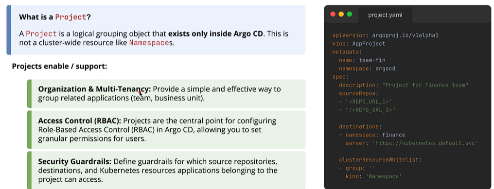
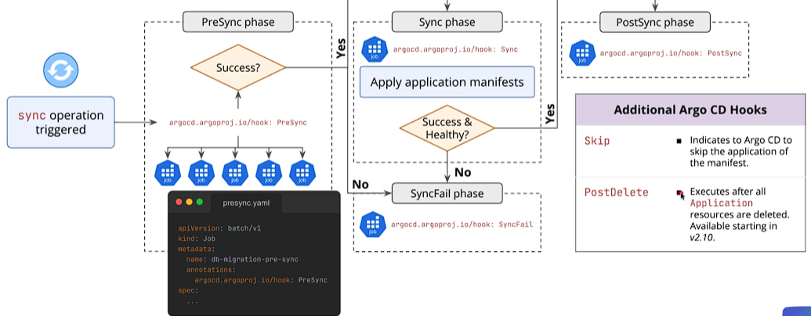
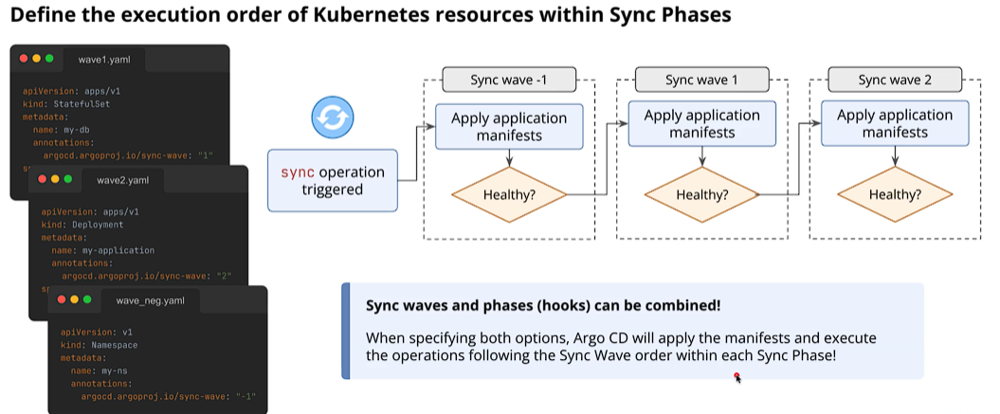

## 1 Argo CD Projects & Multi-Tenancy

1. Logical grouping of applications for better organization and security.
2. Implementing guardrails: Restricting source repositories, destination clusters, and allowed resource kinds.

## 2 Sync Phases & Hooks

1. Running custom logic during the deployment lifecycle.
2. Configuring hook deletion policies (`BeforeHookCreation`, `HookSucceeded`) for resource cleanup.

- Argo CD uses Resource Tracking to isolate applications. When you trigger a sync operation, Argo CD does not run every PreSync or PostSync hook it finds across the cluster. It checks the metadata of each job and only executes hooks that meet two conditions:
1. Belonging to the Application: The hook manifest must be explicitly managed by that specific Argo CD Application (defined inside its source Git repository).
2. Matching Tracking Metadata: Argo CD inspects tracking labels/annotations (such as app.kubernetes.io/instance: <app-name>).
    - Why this matters: If you have 10 different microservices deployed in the same Kubernetes namespace, triggering a sync for Service A will only run Service A's pre-sync database migration job. It will ignore Service B's or Service C's hook jobs, preventing accidental cross-application triggers or unintended pipeline failures.

## 3 Sync Waves
1. Defining precise deployment order using the `argocd.argoproj.io/sync-wave` annotation.
2. Combining waves with phases to orchestrate complex dependencies.

- best practice to avoid consecutive integers so use like 20 then 30 etc