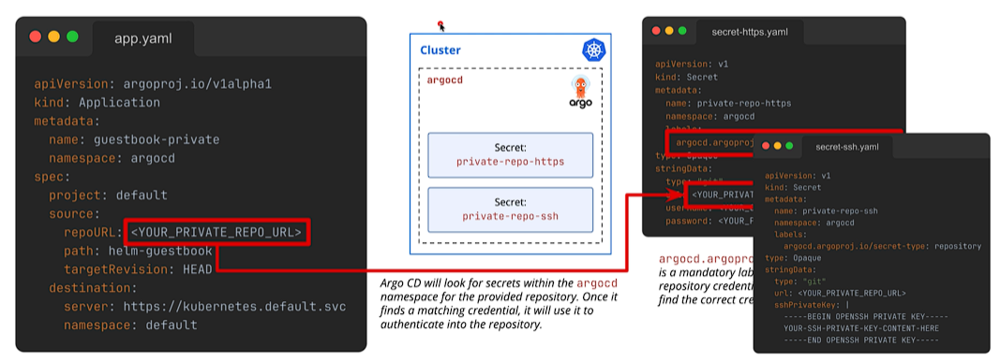

## 1 Connecting to Private Git Repositories
1. Overview of the mechanism: Creating Kubernetes Secrets with specific labels and data schemas.
2. The two primary authentication methods: HTTPS (username + PAT) and SSH (private key).

## 2 Authentication via HTTPS
1. Generating Fine-Grained Personal Access Tokens in GitHub.
2. Configuring repository credentials via the Argo CD UI and the CLI.

## 3 Authentication via SSH
1. Generating SSH key pairs (`ssh-keygen`) and configuring Deploy Keys in the Git provider.
2. Creating the necessary Kubernetes Secrets for SSH authentication.

## Understanding how argo cd connects to private repos via https/ssh
- create a secret for read-only access of the repo such as containing username, password (PAT token), label that contains authentication for a private repo 

-> on the ui, head to settings -> repos -> via http/https -> paste the PAT token at password & put the repo url!

