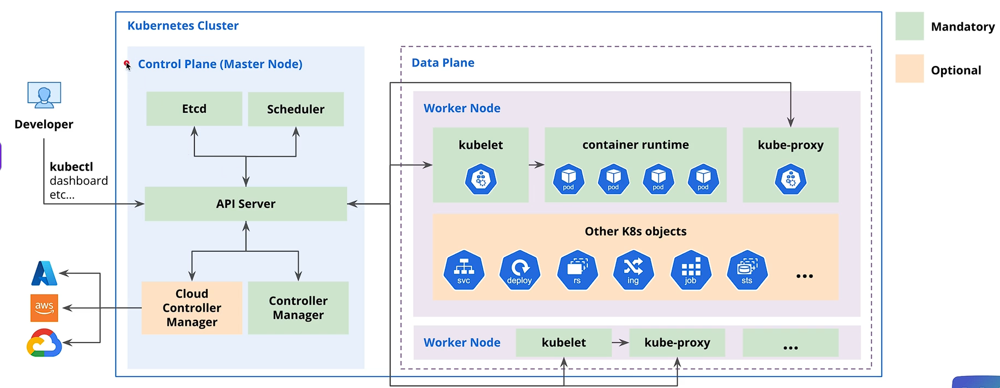

# Kubernetes Architecture



A Kubernetes cluster has two main areas:

- **Control plane:** manages the cluster and decides what should run.
- **Data plane (worker nodes):** runs the application containers.

## Developer tools

Developers interact with the cluster using tools such as `kubectl` or a dashboard. These tools send requests to the Kubernetes API server. They do not communicate directly with worker nodes.

## Control plane

The control plane continuously compares the desired state declared in Kubernetes manifests with the cluster's actual state.

### API server

The API server is the main entry point to Kubernetes. It:

- Receives requests from `kubectl`, controllers, and worker nodes.
- Authenticates and authorizes requests.
- Validates Kubernetes objects.
- Reads and writes cluster state in etcd.

Nearly every Kubernetes component communicates through the API server.

### etcd

etcd is a distributed key-value database that stores the cluster's state, including Pods, Deployments, Services, configuration, and secrets. Losing all etcd data means losing the cluster's recorded state, so backups are important.

### Scheduler

The scheduler finds Pods that do not have a node and selects a suitable worker node based on factors such as:

- Available CPU and memory
- Resource requests
- Node selectors and affinity rules
- Taints and tolerations

The scheduler chooses the node; it does not start the container itself.

### Controller manager

The controller manager runs reconciliation controllers. Each controller watches the API server and works to make actual state match desired state.

For example, if a Deployment requests three replicas but only two Pods are running, a controller creates another Pod.

### Cloud controller manager

The cloud controller manager connects Kubernetes to a cloud provider such as AWS, Azure, or Google Cloud. It can manage cloud-specific resources such as load balancers, routes, nodes, and storage. It is not required for clusters without a cloud-provider integration.

## Worker nodes

Worker nodes provide the CPU, memory, networking, and container runtime used by application workloads. A production cluster normally has multiple worker nodes for capacity and resilience.

### kubelet

The kubelet is the agent running on each worker node. It watches the API server for Pods assigned to its node, asks the container runtime to start them, runs health checks, and reports Pod and node status back to the control plane.

### Container runtime

The container runtime pulls container images and starts, stops, and manages containers. Common runtimes include containerd and CRI-O. Kubernetes communicates with the runtime through the Container Runtime Interface (CRI).

### kube-proxy

kube-proxy implements Service networking on each node. It maintains network rules that route Service traffic to healthy Pods. Some modern networking plugins can replace kube-proxy using technologies such as eBPF.

### Pods

A Pod is the smallest deployable unit in Kubernetes. It contains one or more closely related containers that share networking and storage. Kubernetes schedules Pods, not individual containers.

## Common Kubernetes objects

| Object | Purpose |
| --- | --- |
| **Service (svc)** | Gives a stable network address and load-balances traffic across selected Pods. |
| **Deployment (deploy)** | Manages stateless application Pods, scaling, and rolling updates. |
| **ReplicaSet (rs)** | Ensures that a requested number of identical Pods are running; normally managed by a Deployment. |
| **Ingress (ing)** | Defines external HTTP/HTTPS routing to Services and requires an Ingress controller. |
| **Job** | Runs a task until it completes successfully. |
| **StatefulSet (sts)** | Manages stateful Pods that need stable names, ordered rollout, or persistent storage. |

These objects are stored as desired state through the API server. Controllers act on them, while the resulting Pods run on worker nodes.

## What happens during a deployment

```text
1. Developer applies a Deployment with kubectl
2. API server validates and stores it in etcd
3. Deployment controller creates a ReplicaSet
4. ReplicaSet controller creates the required Pods
5. Scheduler assigns each Pod to a worker node
6. Kubelet asks the container runtime to start the containers
7. Kubelet reports their status to the API server
8. Service networking routes traffic to healthy Pods
```

## High availability

A production cluster should normally have multiple control-plane nodes and multiple worker nodes. etcd commonly uses an odd number of members, such as three or five, so it can maintain quorum when a member fails.
