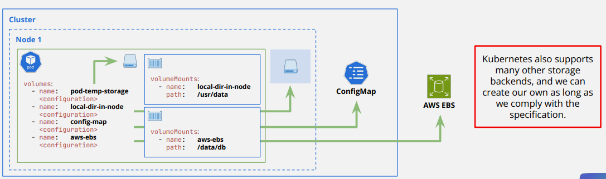

## Persist and share data in Kubernetes
- Volumes are directories, possibly with some data in it, which are accessible to the containers in a pod. How that directory comes to
be, the medium that backs it, and the contents of it are determined by the particular volume type used.
- To use a volume, specify the volumes in the Pod's `.spec.volumes` and declare where to mount those volumes into containers in `.spec.containers[*].volumeMounts`.

## Types of Volume
| Volume Type | When to use |
| --- | --- |
| `emptyDir` | Ephemeral storage within the Pod. Follows the lifecycle of the Pod: when the Pod is terminated, its contents are also deleted. |
| `local*` | Durable storage within a specific node. Requires setting node affinity to correctly schedule Pods on the correct nodes. Preferred over `hostPath` |
| `Persistent Volume` | Durable storage backed by multiple technologies (e.g., cloud storage). Can be statically or dynamically provisioned. |
| `ConfigMap` | Inject configuration data into Pods, without having to hard-code the data into the Pod definition. |
| `Secret` | Inject sensitive data into Pods, without having to hard-code the data into the Pod definition. |

## EmptyDir and Local (Pod- and Node-level Storage)
- emptyDir volumes are ephemeral and defined at the Pod level.
    - The volume is created when the Pod is assigned to a node.
    - The volume is initially empty.
    - All containers in the Pod can read and write the same files in the emptyDir volume.
    - Containers might mount the volume in different paths.
    - When a Pod is removed from a node, the data in the emptyDir is deleted permanently.
- local volumes are persistent and defined at the Node level.
- kube-scheduler knows how to assign Pods to Nodes based on the affinity constraints defined in the PersistentVolume configuration.
- Setting a PersistentVolume nodeAffinity is mandatory when using local volumes.
- Like other PersistentVolumes, it requires creating PersistentVolumeClaims so that Pods can use the storage.
- Only supports static provisioning.
