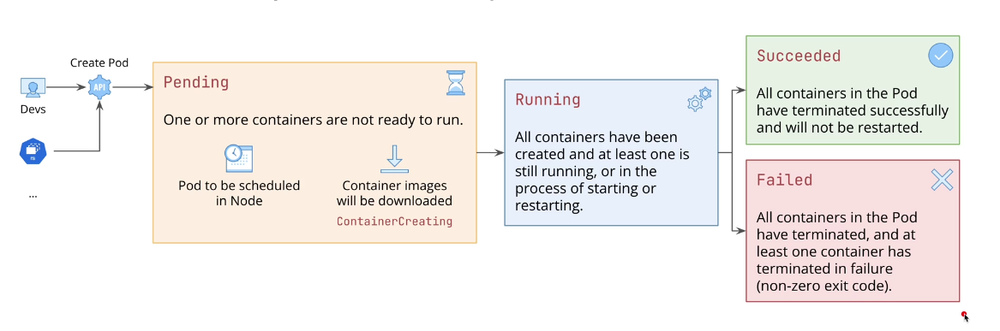
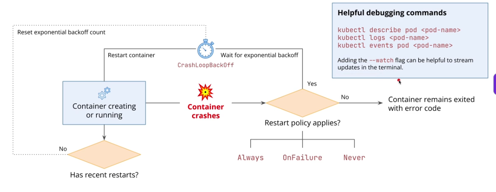

## Pods Lifecycle
- A pod goes from `pending` to `running` and to either `succeed` or `failed`

## Understand how Pods handle errors
- **TL;DR of the whole flow:**
* Container crashes → Kubernetes checks **`restartPolicy`**

  * `Always` → restart
  * `OnFailure` → restart only on error
  * `Never` → don't restart
* If it **keeps crashing**, Kubernetes adds an increasing **backoff delay** between restarts → `CrashLoopBackOff`.
* If it runs successfully for long enough → **backoff resets**.

