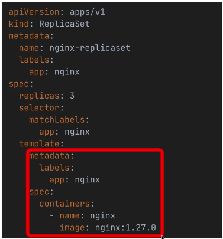

## ReplicaSets

* So far, we ran pods manually and individually. If a pod breaks or enters into an unhealthy state, we need to manually intervene.
* ReplicaSets address the issue of replacing exited or unhealthy pods and making sure that a stable number of identical pods are running at any point in time.
* Ensures high availability and fault tolerance by automatically replacing failed or terminated pods.
* ReplicaSets work by identifying pods via `selectors`, and continuously checking whether the number of running pods matches the desired number of pods specified in the configuration.
* ReplicaSets recreate pods automatically based on the template section in their spec.

