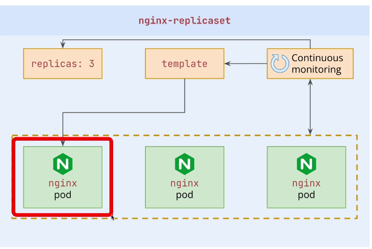

## ReplicaSets

* So far, we ran Pods manually and individually. If a Pod is deleted or its node fails, nothing recreates that standalone Pod.
* ReplicaSets maintain a desired number of matching Pods. When too few exist, the controller creates replacements from the Pod template; when too many exist, it deletes excess Pods.
* A ReplicaSet replaces deleted or terminal Pods. A liveness probe may cause the kubelet to restart an unhealthy container inside the same Pod; that is different from ReplicaSet reconciliation.
* ReplicaSets work by identifying pods via `selectors`, and continuously checking whether the number of running pods matches the desired number of pods specified in the configuration.
* In normal application management, create a Deployment rather than managing a ReplicaSet directly. The Deployment owns ReplicaSets and adds rollout history and rolling updates.

