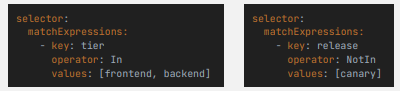

## Labels & Selectors
- Labels are key-value pairs attached to Kubernetes objects (e.g., pods, nodes, services). They provide metadata that helps identify and organize these objects.
- Labels allow Kubernetes users to categorize and organize resources, enabling sophisticated grouping and selection mechanisms. Labels are not unique, and multiple objects can have the same label.
- Selectors are expressions used to filter Kubernetes objects based on their labels. Selectors allow users and Kubernetes components to target specific objects that match certain criteria.

### Operands within selectors?
- By default, it matches whatever it is specified within the `matchLabels` to do equality matching
- But you can also do: `In`, `NotIn`, `Exists`, `DoesNotExist`

