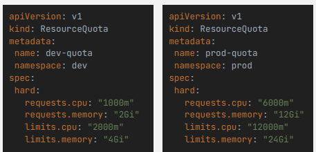
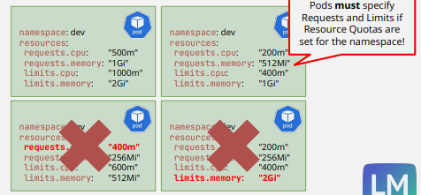

## Resource quotas, requests, and limits

These controls help Kubernetes schedule workloads predictably and prevent one workload or namespace from consuming excessive resources.

### ResourceQuota

A `ResourceQuota` applies to a namespace and limits aggregate resource requests, limits, storage, or object counts. It does not divide resources equally between Pods and does not set defaults. A `LimitRange` can provide per-container defaults and minimum/maximum values.

### Container requests and limits

- A **request** is the amount used by the scheduler when deciding whether a node has capacity for a Pod. It is not a guarantee that the container will continuously consume or receive exactly that amount.
- A **CPU limit** is enforced by throttling the container when it tries to use more CPU.
- A **memory limit** is enforced by terminating the container when it exceeds the limit; this commonly appears as `OOMKilled`.
- Containers may use more than their request when spare capacity exists, up to any configured limit.

Requests also affect Pod Quality of Service classes and eviction priority. Set values from measurements rather than copying arbitrary defaults.

