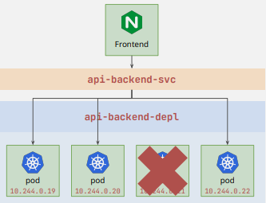

## Services
- Services allow us to expose, through a stable IP or internal DNS name, a network application that is running as one or more Pods in your cluster.

## Types of service
**Abstract pod details to facilitate connectivity**

| Service Type | Behavior | When to use |
| --- | --- | --- |
| `ClusterIP` | Exposes the service on an internal, stable cluster IP.It is only accessible within the cluster. | Best for internal communication between microservices within the cluster.Often combined with ingresses to expose applications via HTTP and HTTPS. |
| `NodePort` | Exposes the service on each Node's IP at a static port.If not specified, picks a port from the range 30000-32767.Accessible from outside the cluster using `<NodeIP>:<NodePort>`. | Useful for exposing a service externally without a load balancer.Often for development or testing. |
| `LoadBalancer` | Exposes the service externally using a cloud provider's load balancer.Provides a single external IP to reach the service. | Ideal for production environments where external access with load balancing is required. |
| `ExternalName` | Maps the service to an external DNS name, redirecting traffic to a service outside the cluster. | Used to allow services within the cluster to access external services via a DNS name. |
