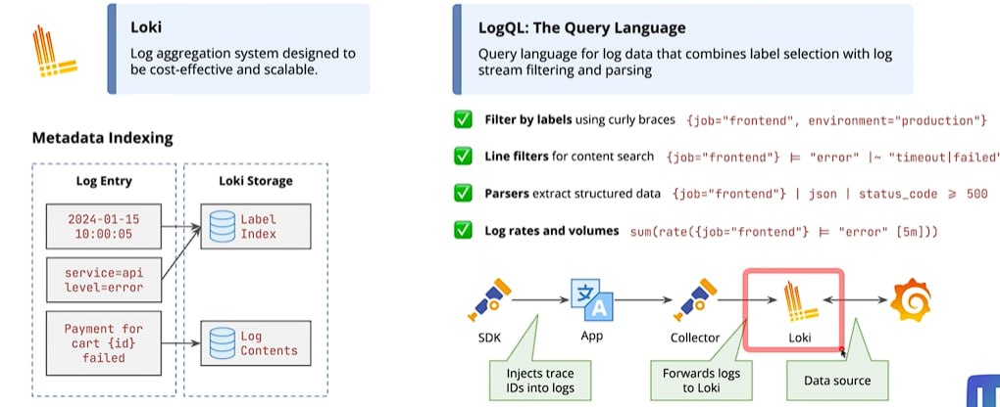

## Loki



### TL;DR

- **Loki** is a log aggregation system created by Grafana Labs.
- It collects logs from applications, containers, servers, and Kubernetes clusters.
- Loki normally receives logs from a collector such as **Grafana Alloy**, Fluent Bit, or the OpenTelemetry Collector.
- It is commonly paired with **Grafana**, which provides the interface for searching and visualizing logs.
- Loki uses **LogQL** as its query language.

### Loki compared with Prometheus

| Prometheus | Loki |
| --- | --- |
| Stores metrics | Stores logs |
| Usually pulls data by scraping `/metrics` | Usually receives logs pushed by a collector |
| Uses PromQL | Uses LogQL |
| Answers "How much?" or "Is it healthy?" | Answers "What exactly happened?" |

Prometheus might show that the error rate increased, while Loki can show the actual error messages that explain why it increased.

### How logs reach Loki

```text
Applications / Docker containers / Kubernetes pods
                         |
                         v
            Grafana Alloy or another collector
                         |
                         v
                       Loki
                         |
                         v
                      Grafana
```

1. An application writes logs to standard output or a log file.
2. A collector reads those logs and attaches labels such as `service`, `container`, or `namespace`.
3. The collector pushes the logs to Loki.
4. Loki stores the logs and indexes their labels.
5. Grafana queries Loki and displays the results.

Unlike many full-text search systems, Loki primarily indexes labels instead of every word in every log line. This can reduce storage and indexing costs.

### Labels and log streams

Labels identify where a log came from:

```text
{service="api", environment="development", container="api-1"}
```

All log entries that share the same labels form a **log stream**.

Use labels for values with a small and predictable number of possibilities, such as service names or environments. Avoid high-cardinality labels such as request IDs, timestamps, or user IDs.

### Useful LogQL examples

Show all logs from the Prometheus container:

```logql
{container="prometheus"}
```

Show only lines containing `ERROR`:

```logql
{container="prometheus"} |= "ERROR"
```

Exclude health-check messages:

```logql
{service="api"} != "healthcheck"
```

Search using a regular expression:

```logql
{service="api"} |~ "timeout|connection refused"
```

Count error messages per service over five minutes:

```logql
sum by (service) (count_over_time({environment="production"} |= "ERROR" [5m]))
```

### Common workflow

1. Run Loki as the log storage and query system.
2. Run Grafana Alloy or another collector near the applications.
3. Configure the collector to read container output or log files.
4. Add Loki as a data source in Grafana.
5. Search logs with LogQL and build dashboards or alerts.

### Similar software

- **Elasticsearch / Elastic Stack**: full-text search and log analytics, commonly viewed through Kibana.
- **OpenSearch**: open-source search and analytics platform with OpenSearch Dashboards.
- **Splunk**: commercial logging, monitoring, and security platform.
- **Graylog**: centralized log management with search, dashboards, and alerts.
- **VictoriaLogs**: log storage and querying system from the VictoriaMetrics ecosystem.
- **Cloud logging services**: AWS CloudWatch Logs, Azure Monitor Logs, and Google Cloud Logging.

### Pros and limitations

- Simple integration with Grafana and the wider Grafana observability stack.
- Cost-efficient because it primarily indexes labels rather than entire log lines.
- Well suited to Docker and Kubernetes environments.
- Label design matters; high-cardinality labels can reduce performance and increase cost.
- Full-text searches may be slower than systems that index the complete contents of every log.
- Loki stores and queries logs, but a separate collector is normally needed to send logs to it.

### Quick best practices

- Prefer structured JSON logs when possible.
- Include useful fields such as timestamp, level, service, and message.
- Keep Loki labels low-cardinality and stable.
- Put values such as request IDs in structured metadata or the log body, not labels.
- Avoid logging passwords, tokens, personal data, or other secrets.
- Use the same service and environment labels across metrics, logs, and traces to make troubleshooting easier.
