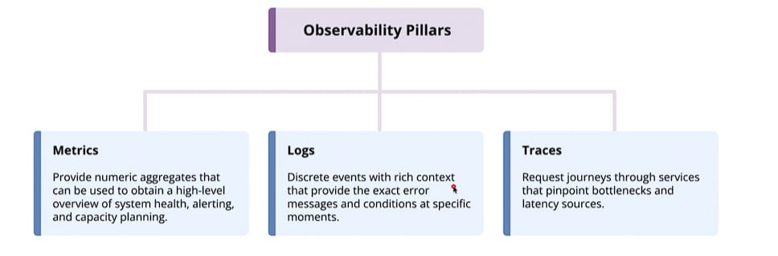
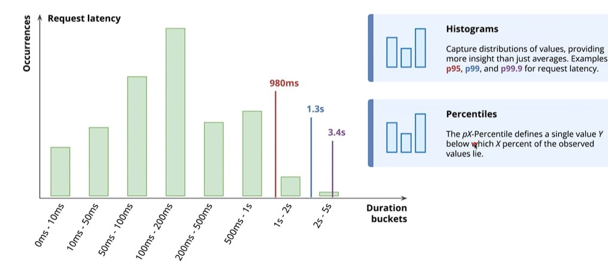

## What is Observability

Understanding system behavior through external systems.

## Monitoring vs. Observability

| Aspect        | Monitoring               | Observability                       |
| ------------- | ------------------------ | ----------------------------------- |
| Question Type | Known questions          | Unknown questions                   |
| Dashboards    | Predefined dashboards    | Exploratory investigation           |
| Focus         | Known failure modes      | Unexpected behaviors                |
| Query         | "Is the system healthy?" | "Why did this request fail?"        |
| Example       | Alert on error rate > 1% | Why did request #123 fail at 13:47? |

## Modern System Complexity

| Traditional Systems            | Modern Distributed Systems              |
| ------------------------------ | --------------------------------------- |
| Single monolithic applications | Hundreds of microservices               |
| Direct function calls          | Network communication                   |
| Static servers                 | Dynamic deployment in containers        |
| Peak-load provisioning         | Auto-scaling based on demand            |
| Single points of failure       | Complex interactions between components |

## Explanation of the Distinction

### 1. Monitoring vs Observability

**Monitoring** tracks known patterns; **Observability** uncovers unprecedented issues.

Monitoring relies on pre-configured checks. You set alerts for issues you already expect to happen (e.g., memory running out or error rate spiking past 1%). It tells you that a failure mode you anticipated is currently occurring.

Observability lets you query raw telemetry data (logs, metrics, traces) in ad-hoc ways to debug issues you have never seen before. It provides context to pinpoint why a specific, edge-case failure happened.

### 2. Why the Shift Happened: System Complexity

In simple monolithic systems on static servers, failures were predictable (e.g., a database disk filled up, or a single server went down). Basic monitoring dashboards were enough.

Modern distributed systems (Kubernetes, microservices, auto-scaling) introduce unpredictable failure modes:

- **Network boundaries**: Functions no longer run in memory; they communicate over unstable networks across services.
- **Ephemeral infrastructure**: Pods and containers spin up and die in seconds, making fixed server dashboards useless.
- **Inter-service dependencies**: Failure rarely comes from one broken node; it emerges from subtle chain reactions across 20 different microservices.

**Summary**: Monitoring keeps you informed of general system health; Observability gives you the high-cardinality data necessary to trace complex, dynamic bugs through distributed systems.

## Three pillars of Observability

## Metrics and Histograms

Quantitative measurements of a system.

### Core Questions

- How fast?
- How many?
- How much?

### Metrics Examples

- Request count: How many HTTP requests?
- Error rate: What percentage of requests are failing?
- Latency: How long do requests take to complete?
- CPU usage: How much CPU are we consuming?
- Active connections: How many database connections are open?

### Types of Metrics

| Metric Type | Description                                                                 | Examples                                                   |
| ----------- | --------------------------------------------------------------------------- | ---------------------------------------------------------- |
| Counters    | Monotonically increasing values. They only go up.                           | Total HTTP requests, total bytes transferred, total errors |
| Gauges      | Point-in-time measurements that can go up or down.                          | Current memory usage, queue depth, CPU percentage          |
| Histograms  | Capture distributions of values, providing more insight than just averages. | p95, p99, and p99.9 for request latency                    |

### Explanation

Metrics are numerical data collected over time to measure system state and performance. These three core types handle different data structures:

#### 1. Counters

**Behavior**: A cumulative value that strictly increases over time (resets to 0 only on process restarts).

**Usage**: Never look at the raw counter value alone. Instead, calculate its rate of change over a time window (e.g., requests per second).

**Why**: Calculating rate over time prevents losing spikes or trends across uneven polling intervals.

#### 2. Gauges

**Behavior**: A real-time snapshot value that fluctuates unpredictably up and down.

**Usage**: Used for resource availability and current load.

**Why**: Unlike counters, rate-of-change math is irrelevant here; you care about the absolute value right now (e.g., Is memory usage currently at 98%?).

#### 3. Histograms

**Behavior**: Samples observations (usually durations or payload sizes) and sorts them into configurable buckets to measure statistical distribution.

**Usage**: Essential for accurately analyzing latency (e.g., response time).

**Why Averages Lie**: A mean average hides extreme outliers. If 99 requests take 10ms and 1 request takes 10,000ms, the average looks acceptable (~109ms), masking a critical issue.

### Percentiles

- **p95**: 95% of requests are faster than this duration.
- **p99**: 99% of requests are faster than this duration (captures tail latency).

### How to Read a Latency Histogram (TL;DR)

#### Look at the Bars (Distribution)

- **X-Axis**: Speed/Duration buckets (fast $\rightarrow$ slow)
- **Y-Axis / Bar Height**: How many requests fell into that speed bucket. Tallest bars = where most users land.

#### Read the Percentile Lines ($pX$)

- **$p95$ (Red Line)**: 95% of requests were faster than this value. Only 5% were slower.
- **$p99$ (Blue Line)**: 99% of requests were faster than this value. Only 1% were slower.

#### Key Takeaway

Ignore averages—they hide bugs. Percentiles tell you how slow your worst-case user experience is.
