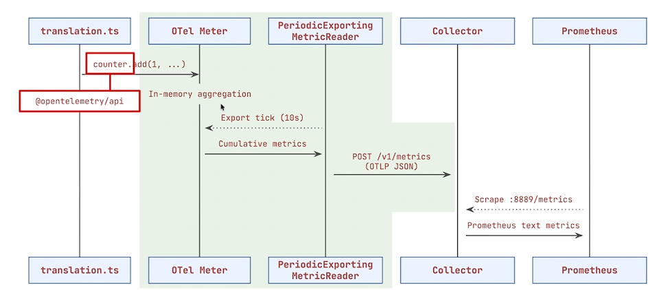

# OpenTelemetry Collector Basics

The OpenTelemetry Collector receives, processes, and forwards telemetry. It usually does not store the data itself.



## Telemetry signals

- **Traces** show how a request moves through an application.
- **Metrics** are numerical measurements such as request counts, latency, CPU, and memory.
- **Logs** are timestamped application events and errors.

For OTLP over HTTP, the endpoint identifies the signal:

```text
/v1/traces  -> traces
/v1/metrics -> metrics
/v1/logs    -> logs
```

An OpenTelemetry SDK selects the correct endpoint automatically based on whether the application creates a span, records a metric, or emits a log.

## Routing in the Collector

Each pipeline connects a receiver to processors and an exporter:

```text
Application -> OTLP receiver -> processors -> backend

Traces  -> Tempo
Metrics -> Prometheus
Logs    -> Loki
```

For example, `exporters: [otlp/tempo]` in the traces pipeline tells the Collector to forward traces through the `otlp/tempo` exporter. Its `endpoint: tempo:4317` setting identifies the Tempo container and port.
