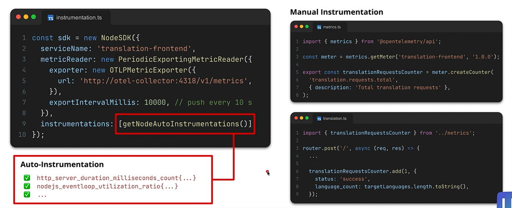

## Automation vs Manual Collection of Traces in TypeScript


- This diagram is basically showing **two ways OpenTelemetry collects metrics from your Node.js app**:

1. **Auto-instrumentation** → OpenTelemetry collects common system/framework metrics for you.
2. **Manual instrumentation** → you explicitly write code to record business-specific metrics.

### Left side: setting up OpenTelemetry

This part creates the OpenTelemetry SDK:

```ts
const sdk = new NodeSDK({
  serviceName: 'translation-frontend',
  metricReader: new PeriodicExportingMetricReader({
    exporter: new OTLPMetricExporter({
      url: 'http://otel-collector:4318/v1/metrics',
    }),
    exportIntervalMillis: 10000,
  }),
  instrumentations: [getNodeAutoInstrumentations()]
});
```

Think of it as:

**Node app → OpenTelemetry SDK → OpenTelemetry Collector**

The important pieces are:

* `serviceName: 'translation-frontend'`

  * Identifies which service generated the metrics.
  * Useful if you have many microservices.

* `OTLPMetricExporter`

  * Sends the metrics using **OTLP**, OpenTelemetry's standard protocol.

* `url: 'http://otel-collector:4318/v1/metrics'`

  * Send those metrics to the OpenTelemetry Collector.

* `exportIntervalMillis: 10000`

  * Every **10 seconds**, batch up the metrics and send them.

---

#### The highlighted part: auto-instrumentation

```ts
instrumentations: [getNodeAutoInstrumentations()]
```

This is basically saying:

> "OpenTelemetry, automatically instrument the common Node.js libraries/frameworks I'm using."

So instead of manually writing:

```ts
recordHttpRequestDuration(...)
recordEventLoopUtilization(...)
recordRequestCount(...)
```

OpenTelemetry's instrumentation libraries can automatically hook into things like HTTP, Express, DNS, database clients, etc.

That's why the diagram shows metrics such as:

```text
http_server_duration_milliseconds_count
nodejs_eventloop_utilization_ratio
...
```

For example, if a request comes in:

```text
POST /translate
```

OpenTelemetry can automatically observe things such as:

```text
number of HTTP requests
request duration
HTTP method
HTTP status code
Node.js event-loop usage
```

without you modifying every route.

---

## Right side: manual instrumentation

Auto-instrumentation doesn't know your **business logic**.

Suppose you want to know:

> "How many translation requests has my application processed?"

OpenTelemetry can't automatically understand that a "translation request" is an important business concept.

So you define your own metric:

```ts
import { metrics } from '@opentelemetry/api';

const meter = metrics.getMeter(
  'translation-frontend',
  '1.0.0'
);

export const translationRequestsCounter =
  meter.createCounter(
    'translation.requests.total',
    {
      description: 'Total translation requests'
    }
  );
```

You have now created a **counter** called:

```text
translation.requests.total
```

Conceptually:

```text
translation.requests.total = 0
```

Then inside your application code:

```ts
router.post('/', async (req, res) => {

  ...

  translationRequestsCounter.add(1, {
    status: 'success',
    language_count: targetLanguages.length.toString(),
  });
});
```

Every successful translation increments the counter:

```text
request 1 → counter = 1
request 2 → counter = 2
request 3 → counter = 3
```

But you're also attaching **attributes**:

```text
status = success
language_count = 3
```

Those let your monitoring system later answer questions like:

```text
How many translation requests succeeded?
How many failed?
How many requests translated into 1 language?
How many translated into 5 languages?
```

---

### The key distinction

Imagine you run a translation website.

**Auto-instrumentation tells you:**

```text
POST /translate received
HTTP response = 200
request latency = 125 ms
CPU usage = ...
event loop utilization = ...
```

Basically:

> "How is my application technically behaving?"

**Manual instrumentation tells you:**

```text
translation requests = 15,432
successful translations = 14,980
failed translations = 452
average languages requested = ...
```

Basically:

> "What is my application actually doing?"

So you normally use **both together**.

```text
                 Node.js application
                        │
          ┌─────────────┴─────────────┐
          │                           │
   Auto Instrumentation       Manual Instrumentation
          │                           │
 HTTP latency                  translations count
 request count                 successful translations
 event loop                    language count
 DB requests                   business-specific stuff
          │                           │
          └─────────────┬─────────────┘
                        ↓
               OpenTelemetry SDK
                        ↓
             OpenTelemetry Collector
                        ↓
          Prometheus / Grafana / etc.
```

