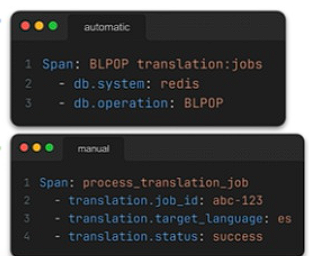
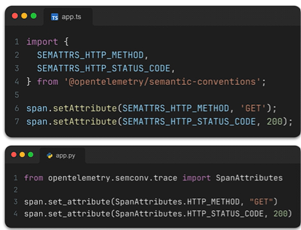

## OpenTelemetry
- An observability framework and toolkit designed to create and manage telemetry data such as traces, metrics and logs
    - It's not yet another backend to store and visualize your data.
    - It is a standardized, vendor-neutral layer between your application and whatever backend you use

-  An observability framework and toolkit designed to create and manage telemetry data such as traces, metrics, and logs.

    * **Vendor Neutrality**
        * You instrument once and can switch backends without changing your code. Want to evaluate three different tracing backends? No problemo!


    * **Industry standardization**
        * OpenTelemetry is backed by all major observability vendors. Prometheus, Grafana, DataDog, New Relic - they all support OpenTelemetry.


    * **Rich ecosystem**
        * Because OpenTelemetry is a standard, there's a huge library of automatic instrumentation. Most of your telemetry can be generated automatically!

### OpenTelemetry API vs SDK

The **API** defines how application code creates telemetry. The **SDK** provides the implementation that processes and exports that telemetry.

```text
Application and instrumentation libraries
                  |
                  v
        OpenTelemetry API
                  |
                  v
        OpenTelemetry SDK
                  |
                  v
OpenTelemetry Collector or backend
```

| Component | Responsibility |
| --- | --- |
| API | Defines tracers, spans, meters, context, and baggage used by code |
| SDK | Implements providers, sampling, processing, resources, and exporting |
| Collector | Receives, processes, and forwards telemetry outside the application |
| Backend | Stores and queries telemetry, such as Tempo for traces |

### OpenTelemetry API

The API is the interface used by application code and instrumentation libraries.

Conceptual example:

```python
tracer = trace.get_tracer("checkout")

with tracer.start_as_current_span("process-payment"):
    process_payment()
```

The API defines concepts such as:

- Tracers and spans
- Meters and metrics
- Context propagation
- Baggage

The API does not decide where telemetry is sent, which spans are sampled, or how telemetry is batched.

Instrumentation libraries should normally depend on the API rather than configure an SDK. This lets the application owner control how telemetry is processed and exported.

### OpenTelemetry SDK

The SDK is the working implementation behind the API. It is configured inside the application and controls:

- Trace and metric providers
- Sampling rules
- Span and metric processors
- Resources such as `service.name`
- Batch processing
- OTLP exporters and their destinations

Conceptual Python example:

```python
resource = Resource.create({
    "service.name": "translation-worker"
})

provider = TracerProvider(resource=resource)
provider.add_span_processor(
    BatchSpanProcessor(
        OTLPSpanExporter(
            endpoint="http://otel-collector:4318"
        )
    )
)
```

If an application uses only the API without registering an SDK provider, telemetry operations are normally no-ops and nothing is exported.

```text
API only       -> application runs, but telemetry is not exported
API plus SDK   -> telemetry is created, processed, and exported
```

### SDK vs Collector

The SDK and Collector have different roles:

- The **SDK** runs inside the application process.
- The **Collector** runs as a separate process or container.
- The SDK can send OTLP data to the Collector.
- The Collector can batch, filter, enrich, and forward data to one or more backends.

For traces in this observability stack:

```text
Frontend / Worker
        |
        | OpenTelemetry SDK exports OTLP
        v
OpenTelemetry Collector
        |
        v
      Tempo
        |
        v
      Grafana
```

### Example: Redis instrumentation

A Redis instrumentation library can use the OpenTelemetry API to create spans such as `GET` or `SET`. The application's SDK decides whether those spans are sampled and sends them to the configured Collector.

The Redis server does not create those application spans. They are created by the instrumented Redis client running inside the frontend or worker.

### Simple analogy

```text
API       = the form used to describe telemetry
SDK       = the worker that prepares and sends the form
Collector = the sorting and forwarding center
Tempo     = the trace archive
Grafana   = the interface used to view the archive
```

### Quick best practices

- Let reusable libraries depend on the API, not configure the SDK globally.
- Configure one SDK provider at the application entry point.
- Set a stable and meaningful `service.name`.
- Prefer OTLP when exporting telemetry.
- Never attach passwords, tokens, or sensitive personal data to telemetry.
- Use a Collector when telemetry needs batching, filtering, enrichment, or multiple destinations.

## Automatic and Manual Instrumentation
Which One to Use? - That depends! Normally start with auto-instrumentation: many metrics with little effort & [Partially obscured text] Once instrumented, extend the codebase to include manual instrumentation for relevant business operations.
### Automatic Instrumentation
- You get telemetry for frameworks and libraries without writing any code.
- OpenTelemetry provides instrumentation libraries for popular frameworks.(Supported languages/runtimes shown: Node.js, Python, Go)

### Manual Instrumentation
- Explicitly write code to create spans, add attributes, and record metrics.
- Why? Automatic instrumentation doesn't know about your business logic. It knows that you called a database, but it doesn't know what business operation that database call was part of.


## The opentelemetry collector 
- Should I / When to use the Collector? There are some pretty good reasons and use cases:
    - Decouple backends from application code: The Collector configuration is separate from your app code, so you can change exporters independently.
    - Send telemetry to multiple backends simultaneously: Maybe you're evaluating tools, or you want both an internal Prometheus and an external vendor.
    - You want centralized sampling or filtering: Rather than configuring sampling in every application, configure it once in the Collector.
    - Legacy migrations: The Collector can receive Jaeger or Zipkin traces and forward them as OTLP, letting you migrate incrementally.
    - Transform or enrich data: Add attributes, scrub sensitive data, or reshape telemetry before it reaches backends.
-  The OpenTelemetry Collector acts as an out-of-process proxy between your application code and your observability backend.
    * **Application Decoupling:** Instead of importing vendor-specific SDKs into your application code and embedding backend API keys or logic into your microservices, your app points all telemetry (traces, metrics, logs) to a local endpoint via the OpenTelemetry Protocol (OTLP).
    * **Backend Agnostic:** The Collector receives the incoming standard stream and routes it to whatever software or storage you select. Changing your trace storage from Jaeger to Tempo, or routing to Datadog and internal storage simultaneously, only requires updating a single Collector configuration file—zero application code changes required.
    * **Protocol Ingestion:** Beyond OTLP, the Collector features built-in "Receivers" that can accept incoming data in older formats (e.g., legacy Zipkin or Jaeger formats) and standard "Exporters" to translate and forward data out to hundreds of different backends.

## Semantic Conventions 
* You can't typo the attribute name
* Auto-complete helps you discover available conventions
* Your code stays up-to-date if convention names evolve
* It's self-documenting: readers know you're following standards
