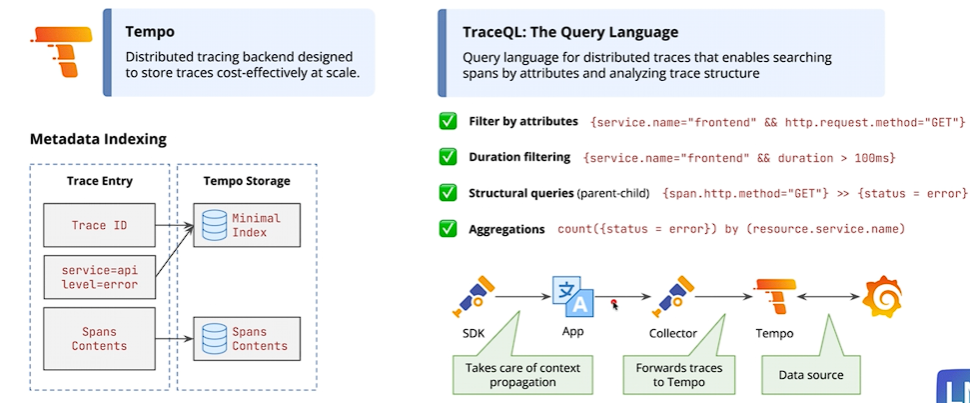

## Tempo



### TL;DR

- **Grafana Tempo** is a backend for storing and querying distributed traces.
- A trace follows one request as it travels through an application and its services.
- Applications normally create traces using **OpenTelemetry** instrumentation.
- Grafana Alloy or the OpenTelemetry Collector forwards traces to Tempo.
- Grafana uses Tempo as a data source to search and visualize traces.
- Tempo uses **TraceQL** as its query language.

### Why tracing is useful

Metrics can reveal that requests are slow, and logs can show individual events. Traces show where a request spent its time and how its operations relate to each other.

```text
Checkout request: 900 ms
  |-- API validation: 40 ms
  |-- Payment service: 700 ms
  |     `-- Database query: 650 ms
  `-- Notification service: 100 ms
```

This trace suggests that the database call inside the payment service is the main source of latency.

### Core concepts

- **Trace**: the complete journey of one request through a system.
- **Span**: one operation within a trace, such as an HTTP request or database query.
- **Root span**: the first span representing the overall request.
- **Parent and child spans**: relationships that show which operation called another operation.
- **Trace ID**: an identifier shared by every span in the same trace.
- **Span ID**: an identifier for one individual span.
- **Duration**: how long a span took to complete.
- **Attributes**: metadata such as service name, HTTP method, route, or status.
- **Context propagation**: passing the trace ID and other context between services so their spans belong to the same trace.

### How traces reach Tempo

```text
Instrumented application
          |
          v
OpenTelemetry Collector or Grafana Alloy
          |
          v
        Tempo
          |
          v
        Grafana
```

1. An instrumented application creates spans while processing a request.
2. Trace context is propagated when the request moves between services.
3. A collector receives and processes the spans.
4. The collector sends the spans to Tempo, commonly using OTLP.
5. Tempo stores the traces.
6. Grafana queries Tempo and displays each trace as a timeline.

Tempo is the storage and query backend. It does not automatically create traces for an application; the application must be instrumented manually or through automatic instrumentation.

### Tempo, Loki, and Prometheus

| System | Stores | Main question |
| --- | --- | --- |
| Prometheus | Metrics | Is something wrong? |
| Loki | Logs | What happened? |
| Tempo | Traces | Where in the request did it happen? |
| Grafana | Visualizations | How can I investigate the signals together? |

Example investigation:

1. Prometheus reports an increase in API latency.
2. Tempo shows that database spans are slow.
3. Loki shows database timeout errors with the same trace ID.
4. Grafana lets the operator move between these related signals.

### Useful TraceQL examples

Find traces containing spans from the `api` service:

```traceql
{ resource.service.name = "api" }
```

Find traces containing errors:

```traceql
{ status = error }
```

Find spans that took longer than 500 milliseconds:

```traceql
{ duration > 500ms }
```

Combine service and duration filters:

```traceql
{ resource.service.name = "payment" && duration > 1s }
```

### Common workflow

1. Instrument the application with an OpenTelemetry SDK or automatic instrumentation.
2. Configure trace context propagation between services.
3. Send spans to Grafana Alloy or an OpenTelemetry Collector.
4. Configure the collector to export traces to Tempo.
5. Add Tempo as a Grafana data source.
6. Search by trace ID, service, duration, status, or attributes using TraceQL.
7. Correlate traces with related Prometheus metrics and Loki logs.

### Similar software

- **Jaeger**: open-source distributed tracing and trace visualization system.
- **Zipkin**: distributed tracing system focused on collecting and displaying request timing data.
- **Elastic APM**: application performance monitoring with traces stored in the Elastic ecosystem.
- **AWS X-Ray**: managed tracing service for applications running in AWS.
- **Google Cloud Trace**: managed tracing service in Google Cloud.
- **Azure Application Insights**: application monitoring and distributed tracing in Azure.

### Pros and limitations

- Integrates closely with Grafana, Loki, Prometheus, and OpenTelemetry.
- Helps locate latency bottlenecks and failures across service boundaries.
- Designed for cost-effective, high-volume trace storage.
- Requires application instrumentation and correct context propagation.
- Sampling may be needed because retaining every trace can consume significant storage.
- Traces are less useful when important services fail to propagate trace context.

### Quick best practices

- Use OpenTelemetry for vendor-neutral instrumentation and OTLP for trace transport.
- Set a consistent `service.name` for every service.
- Propagate trace context across every network and messaging boundary.
- Include trace IDs in structured logs to correlate Tempo traces with Loki logs.
- Capture useful attributes, but never attach passwords, tokens, or sensitive personal data.
- Use sampling to control volume while retaining errors and unusually slow requests.
- Keep service names and environment attributes consistent across metrics, logs, and traces.

### References

- [Introduction to Grafana Tempo](https://grafana.com/docs/tempo/latest/introduction/)
- [TraceQL documentation](https://grafana.com/docs/tempo/latest/traceql/)
- [Grafana Tempo data source](https://grafana.com/docs/grafana/latest/datasources/tempo/)
